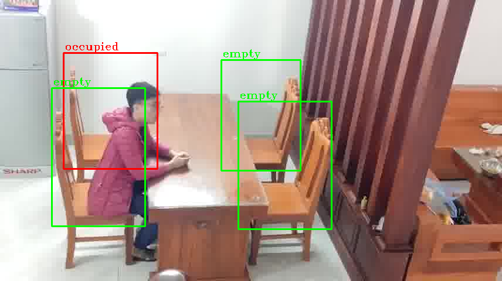
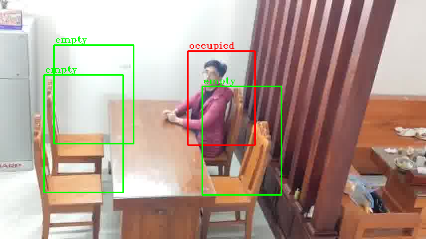
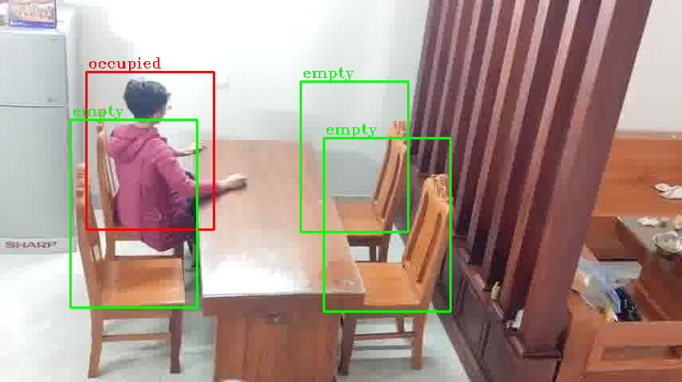

# Video-Focused-Seat-Occupancy-Detection-YOLOv8

## **Built With**
- Python 3.11  
  [](https://www.python.org/downloads/release/python-3110/)

## **References**
- [ultralytics/ultralytics](https://github.com/ultralytics/assets/releases/tag/v8.2.0)
- [TheBlackCat22/Seat-Occupancy-Detection](https://github.com/TheBlackCat22/Seat-Occupancy-Detection)  

---

This repository implements a lightweight seat occupancy detection system using a pre-trained YOLOv8 model for **video-based input**.

## **Methodology**
### **1. Frames:** 
- Input video is splitted into frames using PyAV, which later are processed into NumPy array with the format `bgr24`.These frames are then converted from BGR to RGB using OpenCV (`cv2`) for YOLO predicting.

### **2. Region of Interest (ROI):**
- Input images are resized and manually cropped to focus on regions of interest (ROIs), including smaller, detailed sub-ROIs.

### **3. Object Detection:**
- The pre-trained YOLOv8n model (`yolov8n.pt`), sourced from [Ultralytics v8.2.0](https://github.com/ultralytics/assets/releases/tag/v8.2.0), detects objects and humans within the ROIs corresponding to chairs in each processed frame. chair in a processed frame.
  
- **Chair Status Determination**:
  - If nothing is detected then check on smaller ROIs.
  -  If the detection results include the value `0`, the corresponding chair is marked as "**occupied**".
  -  If `0` is not detected but other values are present:
        - Determine whether these values are unimportant. If they are, the chair is marked as "**empty**".
        - Otherwise, the chair is marked as "**occupied**".
- **Output**:
  - For each returned dataframe, the system generates a `.csv` file named `Status_{FrameIndex}`.csv, which contains the following columns
    - `Chair Number`
    - `Status` (`1` for **occupied**, `0` for **empty**)
---

## **Instructions**  

### **1. Installation**  
- Install the required libraries listed in `requirements.txt` using Python (version >= 3.11).  
  [Download Python 3.11](https://www.python.org/downloads/release/python-3110/).  
- Run the following command in your terminal to install all dependencies:  

```
pip install -r requirements.txt
```

### **2\. Setting Up Data** 
1. **Prepare Your Video** 
* Ensure your video file is located in the `/data` directory.”
2. **Update Configuration**
* Open the `source/DetectionSettings.py` file.
* Update the `VIDEO_PATH` variable to point to your video file: python CopyEdit”
```
VIDEO_PATH = "../data/{your_video_name}.mp4"
```
* Adjust the Regions of Interest (ROIs) within the same file as needed.
* Update the IMAGE_SIZE variable to match your desired dimensions:
```
IMAGE_SIZE = (width, height)
```
3. **Run the Program** 
* Execute the script in your terminal or IDE to process the video and detect seat occupancy.”
### **Attention** 
* Unexpected errors may occur during compilation or execution. Additional adjustments might be required based on your system and dataset configuration.


---

This methodology is **heavily inspired** by the approach in [TheBlackCat22/Seat-Occupancy-Detection](https://github.com/TheBlackCat22/Seat-Occupancy-Detection) and builds upon it's idea with notable adjustments and optimizations to enhance performance.

---

## **Results**
Below are sample processed frames from a custom test video featuring a dining room setup:

  
  


### **Notes:**
- This project was developed by undergraduate students as part of a learning initiative.